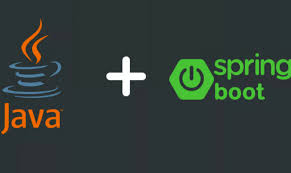

### PROYECTO DE BACK-END JAVA 

- Este programa mapea una tabla de una base de datos applicando ORM de JPA en java.
- Para la creacion de este proyecto se uso dependencia del framework de Spring Boot.
- La arquitectura que se pretende usar es MVC.

# Tecnologías usadas.

**Table of Contents**

[TOCM]

[TOC]

